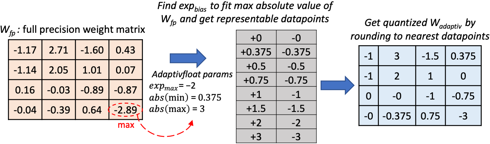

##AdaptivFloat: A Floating-Point Based Data Type for Resilient Deep Learning Inference

AdaptivFloat is a floating-point inspired number representation format for deep learning that dynamically maximizes and optimally clips its available dynamic range, at a layer granularity, in order to create faithful encoding of neural network parameters.



AdaptivFloat consistently produces higher inference accuracies compared to block floating-point, uniform, IEEE-like float or posit encodings at very low precision ($\leq$ 8-bit) across a diverse set of state-of-the-art neural network topologies.

The table below shows the impact of weight bit compression on the BLEU score of the Transformer model post-training quantization / post-quantization aware retraining. More results on the paper (see reference below):

| # Bits |                     Float                    |     BFP     |   Uniform   |    Posit    | AdaptivFloat |
|-------|:--------------------------------------------:|:-----------:|:-----------:|:-----------:|:------------:|
| 16    |                  27.4 / 27.4                 | 27.4 / 27.4 | 27.4 / 27.4 | 27.4 / 27.5 |  27.4 / 27.6 |
| 8     |                  27.2 / 27.5                 | 26.3 / 27.3 | 27.3 / 27.4 | 27.3 / 27.5 |  27.3 / 27.7 |
| 7     |                  27.1 / 27.5                 | 16.9 / 26.8 | 26.0 / 27.2 | 27.3 / 27.4 |  27.3 / 27.7 |
| 6     |                  26.5 / 27.1                 |  0.16 / 8.4 | 0.9  / 23.5 | 26.7 / 27.2 |  27.2 / 27.6 |
| 5     |                  24.2 / 25.6                 |  0.0 / 0.0  |  0.0 / 0.0  | 25.8 / 26.6 |  26.4 / 27.3 |
| 4     |                   0.0 / 0.0                  |  0.0 / 0.0  |  0.0 / 0.0  |  0.0 / 0.0  |  16.3 / 25.5 |

## Algorithm

The base algorithm can be found on the script [`adaptivfloat.py`] file

## Citation

If you find this resource useful, please consider citing the following paper:

```
@article{Tambe2019AdaptivFloatAF,
  title={AdaptivFloat: A Floating-point based Data Type for Resilient Deep Learning Inference},
  author={Thierry Tambe and En-Yu Yang and Zishen Wan and Y. Deng and V. Reddi and Alexander M. Rush and D. Brooks and Gu-Yeon Wei},
  journal={ArXiv},
  year={2019},
  volume={abs/1909.13271}
}
```
